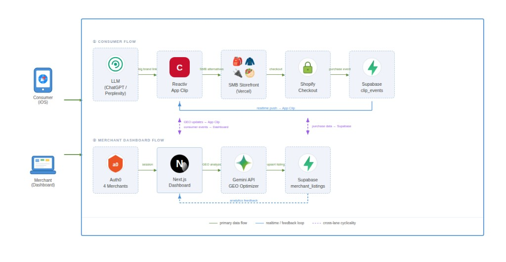

# CanadaClip 🍁

*Big brands stole your customers. We steal them back.*

[](https://nextjs.org/) [](https://swift.org/) [](https://ai.google.dev/) [](https://supabase.com/) [](https://auth0.com/) [](https://vercel.com/) [](https://tailwindcss.com/)

[](https://hackcanada.com/)

---

## 💥 **The Problem**

> **Nike spends $4,000,000,000 per year on marketing.** That's $11M every single day.  
> Shawarma Palace on Bloor spends $0 — and wonders why AI never recommends them.

**58% of consumers** now rely on AI for product recommendations. When ChatGPT suggests a jacket, it suggests The North Face — not the Canadian indie brand. **GEO (Generative Engine Optimization)** is the new SEO: the rules of how products get surfaced in LLM answers. **98% of Canadian SMBs** have never heard of it. We're here to change that.

---

## 📱 **How It Works**

### Consumer flow

| Step | What happens |
|------|----------------|
| 🤖 | User gets a Nike / Amazon / ASOS link from ChatGPT |
| 📱 | **Reactiv App Clip** activates instantly in Safari — **no download** |
| ✨ | **Gemini** surfaces 3–4 Canadian alternative businesses |
| 🛍️ | **Shopify** checkout in one tap |

### Merchant flow

| Step | What happens |
|------|----------------|
| 🔐 | **Auth0** login → isolated merchant dashboard |
| 📊 | See exactly which customers big brands are stealing |
| 🧠 | **Gemini GEO Optimizer** analyzes your listings |
| ⚡ | One click → **live storefront updates** instantly via **Supabase** |

---

## 🏗️ **Architecture**



---

## 🔄 **The Flywheel**

```
   Consumer Clip Events
            ↓
   Merchant Analytics  ←───  More Traffic
            ↓                      ↑
   GEO Improvements  ───→  Better Listings
```

*Steal traffic → measure it → optimize with AI → steal more.*

---

## 🛠️ **Tech Stack**

| Layer | Technology | Purpose |
|-------|------------|---------|
| **App Clip** | Swift, SwiftUI, Reactiv ClipKit | Instant, no-install consumer experience |
| **Dashboard** | Next.js 14, TypeScript, Tailwind, Recharts | Merchant analytics & GEO tools |
| **Auth** | Auth0 | Isolated merchant tenants (4 stores) |
| **AI** | Gemini API | Alternative discovery + GEO optimizer |
| **Database** | Supabase (Postgres + Realtime) | Listings, analytics, live updates |
| **Hosting** | Vercel | Dashboard + 4 merchant storefronts |
| **Checkout** | Shopify | One-tap purchase from the clip |

---

## ⚡ **Quick Start**

### Backend (dashboard)

```bash
cd backend
npm install
cp .env.example .env.local   # fill in keys
npm run dev                   # http://localhost:3000
```

### Frontend (App Clip)

- Open `frontend/ReactivChallengeKit/ReactivChallengeKit.xcodeproj` in **Xcode**
- **Requirements:** Xcode 26+, iOS 17+ simulator
- **Build & Run:** `Cmd+R`

---

## 🔑 **Environment Variables**

| Variable | Required | Purpose |
|----------|----------|---------|
| `NEXT_PUBLIC_SUPABASE_URL` | ✅ | Supabase project URL |
| `NEXT_PUBLIC_SUPABASE_ANON_KEY` | ✅ | Supabase anon key |
| `SUPABASE_SERVICE_ROLE_KEY` | ✅ | Supabase service role (GEO updates) |
| `AUTH0_SECRET` | ✅ | Auth0 session secret |
| `AUTH0_BASE_URL` | ✅ | App URL (e.g. `https://canada-clip-dashboard.vercel.app`) |
| `AUTH0_ISSUER_BASE_URL` | ✅ | Auth0 tenant URL (no trailing slash) |
| `AUTH0_CLIENT_ID` | ✅ | Auth0 application client ID |
| `AUTH0_CLIENT_SECRET` | ✅ | Auth0 application client secret |
| `GEMINI_API_KEY` | ✅ | Google AI Studio API key |

Copy `backend/.env.example` to `backend/.env.local` and fill in values.

---

## 🔗 **Live Demo**

| Link | Description |
|------|-------------|
| 🔗 [**Dashboard**](https://canada-clip-dashboard.vercel.app) | Merchant GEO dashboard |
| 🎒 [**Northbound Packs**](https://northbound-backpacks.vercel.app) | Merchant storefront |
| 🧥 [**StreetRoot Co**](https://streetroot-co.vercel.app) | Merchant storefront |
| 🔌 [**NorthTech Goods**](https://northtech-goods.vercel.app) | Merchant storefront |
| 🥙 [**Shawarma Palace**](https://shawarma-palace.vercel.app) | Merchant storefront |

*Open the dashboard, then hit a merchant storefront and watch GEO in action.*

---

## 👥 **Team**

| Name | Role |
|------|------|
| **Ammar Adam** | Dashboard, backend, architecture |
| **Pranav Marthi** | iOS App Clip (SwiftUI + Reactiv ClipKit) |
| **Roderick Liao** | Figma UI/UX, 3D Launch Video |

---


### Walkthroughs

| Video | Link |
|-------|------|
| 📐 Architecture | [Loom](https://www.loom.com/share/100ad7c247234142b147d6d53030aa96) |
| 🎨 Frontend | [Loom](https://www.loom.com/share/6bf8454b60884548a467eee4c5e2b815) |
| ⚙️ Backend | [Loom](https://www.loom.com/share/32dd42931c0f4190ae05e0f3d47f1879) |
| ✨ Animated demo | [Google Drive](https://drive.google.com/file/d/1y2qr6llciL2pgqPU5PtuVDP4nNlAj5ih/view) · [YouTube](https://www.youtube.com/watch?v=as1ukU6VLSk) |

---

## 📁 **Repo Structure**

```
canada-clip-dashboard/
├── backend/     ← Next.js 14 dashboard (Vercel)
└── frontend/    ← Swift/SwiftUI App Clip (Reactiv ClipKit)
```

---

*Built in 36 hours at Hack Canada 2026 · Waterloo, Ontario*

**Try the live dashboard → then steal some traffic back.**
